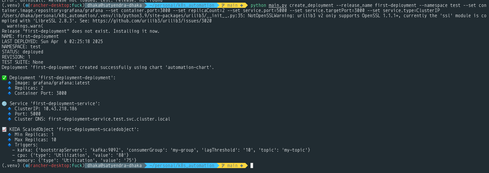
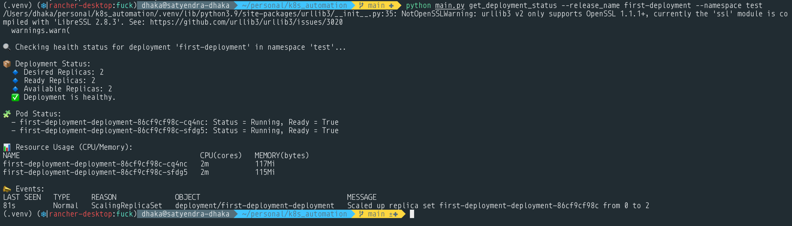

# Kubernetes Cluster Setup and Deployment

This project provides a set of scripts to automate the setup of a Kubernetes cluster and the deployment of applications using Helm. It includes the installation of necessary CRDs, Helm charts, and the creation of deployments.

## Prerequisites

- Python 3.6+
- Kubernetes cluster
- `kubectl` configured to access your cluster

## Installation

1. Clone the repository:

    ```sh
    git clone https://github.com/satyendradhaka/k8s_automation
    cd k8s_automation
    ```

2. Install the required Python packages:

    ```sh
    pip install -r requirements.txt
    ```

## Usage

### Connect to Kubernetes Cluster

To connect to your Kubernetes cluster and install necessary tools:

```sh
python main.py connect --config <path-to-kubeconfig>
```

- `--config`: Path to the kubeconfig file (default: `~/.kube/config`)

### Create Deployment

To create a deployment in the Kubernetes cluster:

```sh
python main.py create_deployment --namespace <namespace> --release_name <release-name> --set <key=value> --values_file <path-to-values-file>
```

- `--namespace`: The Kubernetes namespace
- `--release_name`: The name of the Helm release
- `--set`: Helm set parameters (optional, can be used multiple times)
- `--values_file`: Path to the Helm values file (optional)

Sample Output


### Get Deployment Status

To check the health status of a deployment:

```sh
python main.py get_deployment_status --namespace <namespace> --release_name <release-name>
```

- `--namespace`: The Kubernetes namespace
- `--release_name`: The name of the Helm release

Sample output


## Scripts

### `main.py`

The main entry point for the script. It provides commands to connect to the Kubernetes cluster, create deployments, and check deployment status.

### `setup_cluster.py`

Contains functions to connect to the Kubernetes cluster, install Helm, KEDA, and Metric Server, and summarize the cluster setup.

### `create_deployment.py`

Contains functions to create Helm commands, deploy applications.

### `deployment_status.py`

Contains functions to check the health status of deployments, including pod status, resource usage, and events.

### `utils.py`

Contains utility functions, such as running `kubectl` commands.
